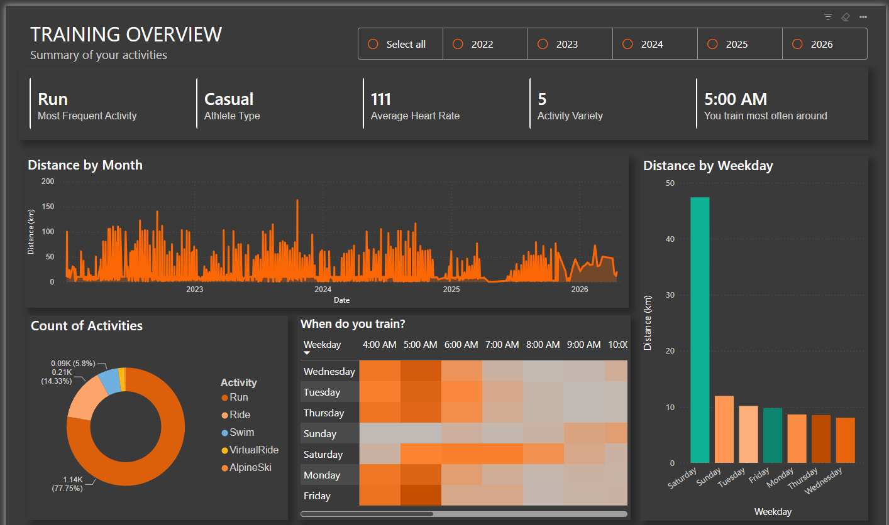
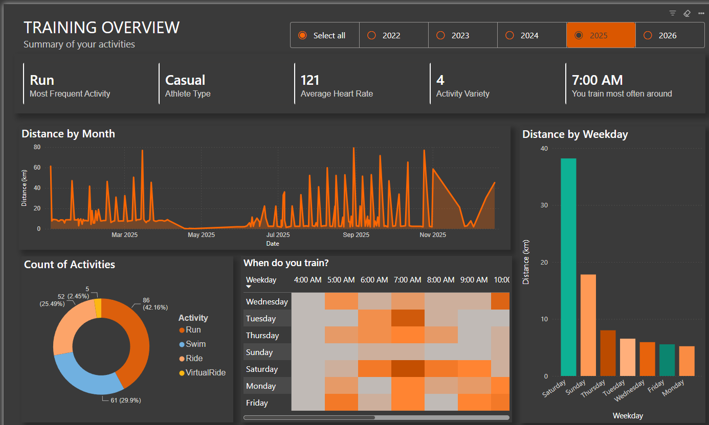
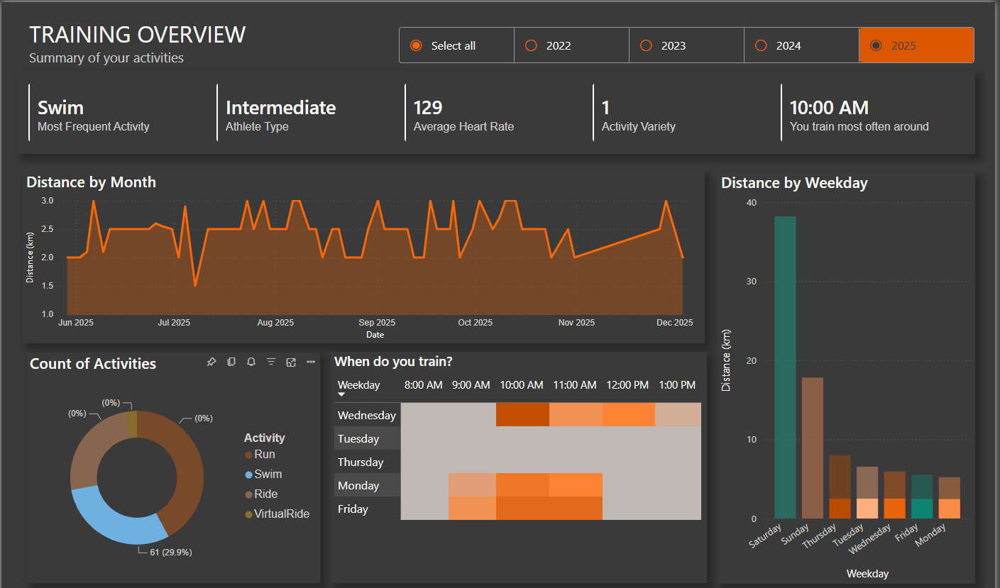
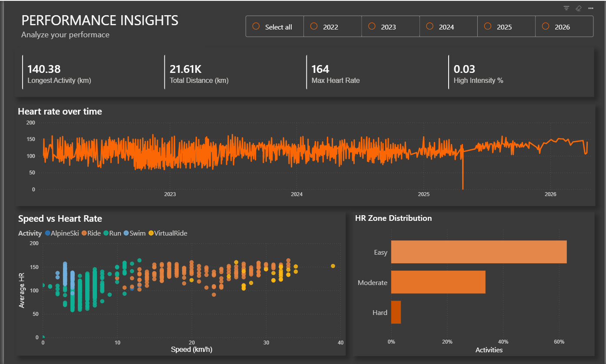
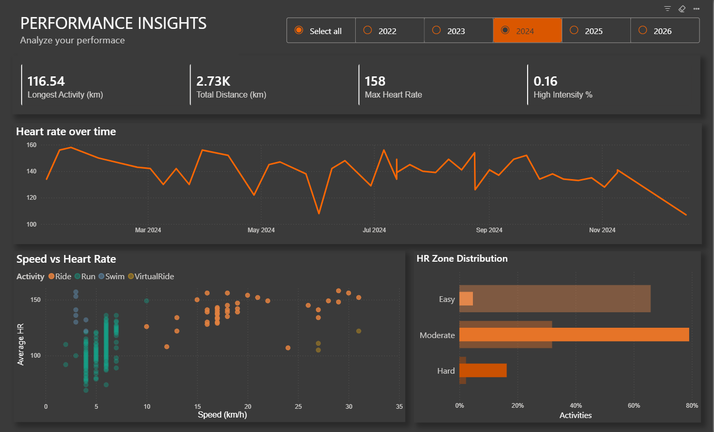

# Strava API — Data Extraction, Processing and Visualization
 
ETL pipeline that pulls athlete activity data from the **Strava REST API v3**, transforms it with **Python / pandas**, and exposes it through an interactive **Power BI** report built on **DAX** measures.
 
Coursework project — Nikola Vaptsarov Naval Academy, Department of Information Technologies.
 
## Stack
 
| Layer | Technology |
|---|---|
| Authorization | OAuth 2.0 (authorization code + refresh token flow) |
| Data source | Strava REST API v3, JSON over HTTPS, `requests` |
| Transformation | Python 3, `pandas`, `python-dotenv` |
| Intermediate storage | CSV |
| Model & visuals | Power BI Desktop, DAX |
 
## Architecture
 
```
Strava API ──HTTPS/JSON──> app.py ──> processed_activities.csv ──> dashboard.pbix
```
 
Python owns network access and row-level computation; Power BI owns aggregation and presentation. The CSV is the contract between them, so the report refreshes without re-authenticating against the API.
 
## Extract
 
Strava issues no static API key — every request carries a short-lived bearer token obtained via OAuth 2.0. The script opens the authorize URL with scope `read,activity:read_all` (required to return private activities), parses the `code` parameter out of the pasted redirect URL, and exchanges it at `/oauth/token` for an access and refresh token pair. The full payload is cached in `tokens.json`; on every later run the script refreshes instead of re-authorizing, so no user interaction is needed after the first time.
 
Activities are read from `GET /api/v3/athlete/activities` with `per_page=200` (the API maximum) and an incrementing page counter, until the response returns an empty array. Only summary activity objects are requested — detailed streams are not needed at activity granularity. Batching at 200 keeps the run within Strava's rate limits (200 requests / 15 min, 2000 / day).
 
## Transform
 
Seven source fields are kept: `type`, `distance`, `moving_time`, `total_elevation_gain`, `start_date`, `average_speed`, `average_heartrate`.
 
**Unit conversion** — the API returns SI base units: distance m → km, `moving_time` s → min (moving rather than elapsed time, so pauses don't distort pace), speed m/s → km/h.
 
**Temporal decomposition** — `start_date` is parsed to datetime and expanded into `month` (`YYYY-MM`), `weekday` and `hour`, which become the grouping keys of the report.
 
**Cleaning** — rows with null distance or null heart rate (activities recorded without a HR sensor) are dropped, along with zero-distance rows; the set is restricted to dates from 2022-01-01 onward.
 
**Classification** — two categorical columns are derived per row: `hr_zone` from average heart rate (Easy < 120, Moderate < 150, Hard ≥ 150) and `intensity` from speed (Easy < 8, Moderate < 12, Hard ≥ 12 km/h).
 
## Output schema
 
`processed_activities.csv` — one row per activity.
 
| Column | Type | Notes |
|---|---|---|
| `type` | text | Run, Ride, Swim, VirtualRide, AlpineSki |
| `date` | datetime | ISO 8601 with offset |
| `month` / `weekday` / `hour` | text / text / int | grouping keys |
| `distance_km` | float | |
| `duration_min` | float | from moving time |
| `speed_kmh` | float | |
| `total_elevation_gain` | float | metres |
| `avg_hr` | float | renamed from `average_heartrate` |
| `hr_zone` / `intensity` | text | Easy / Moderate / Hard |
 
## Power BI model
 
Single flat fact table imported through Power Query, with no separate dimension layer — all grouping keys are materialized in the Python stage rather than as calculated columns, keeping DAX for measures only. `weekday` uses a custom sort-by column so the axis follows Monday→Sunday; `date` drives the continuous trend axis; `hour` is the column axis of the matrix visual. A year slicer filters both report pages.
 
## DAX measures
 
Measures evaluate at query time against the current filter context (year slicer, cross-filtering from the donut and legend fields). The model defines total distance, longest activity, average and max heart rate, activity count, activity variety, high-intensity share, training frequency, most frequent activity and peak training hour.
 
Ratios use `DIVIDE` rather than `/`, which returns blank instead of an error on an empty context, with `CALCULATE` overriding the filter context in the numerator only:
 
```dax
High Intensity % =
DIVIDE (
    CALCULATE ( COUNTROWS ( processed_activities ), processed_activities[intensity] = "Hard" ),
    COUNTROWS ( processed_activities )
)
```
 
The athlete classification combines training frequency (activities per active month, using `DISTINCTCOUNT` on `month` so inactive months don't dilute the ratio), average speed and activity variety into one categorical label via `SWITCH ( TRUE(), ... )` — the DAX equivalent of an if/else-if chain:
 
```dax
Athlete Type =
VAR Freq     = [Training Frequency]
VAR AvgSpeed = AVERAGE ( processed_activities[speed_kmh] )
VAR Variety  = [Activity Variety]
RETURN
    SWITCH (
        TRUE (),
        Freq >= 12 && AvgSpeed >= 12 && Variety >= 3, "Advanced",
        Freq >= 6  && AvgSpeed >= 8,                  "Intermediate",
        "Casual"
    )
```
 
The ranking measures (`Most Frequent Activity`, `Peak Training Hour`) return text rather than a number so they can be bound directly to card visuals: `SUMMARIZE` builds a virtual grouped table, `TOPN` keeps the highest-count row, `MAXX` extracts the scalar.
 
## Report pages
 
**Training Overview** — cards bound to `Most Frequent Activity`, `Athlete Type`, `Average Heart Rate`, `Activity Variety`, `Peak Training Hour`; distance over the date axis; distance by weekday; activity count by type (donut); `weekday` × `hour` matrix with conditional formatting.
 

 
Year slicer applied — every measure re-evaluates in the narrowed context.
 

 
Cross-filtering by clicking a donut segment propagates the activity-type filter to all visuals, including the `Athlete Type` classification.
 

 
**Performance Insights** — cards bound to `Longest Activity`, `Total Distance`, `Max Heart Rate`, `High Intensity %`; heart rate over time; scatter of `speed_kmh` against `avg_hr` with `type` as legend; activity share by `hr_zone`.
 

 

 
## Setup
 
```bash
pip install requests pandas python-dotenv
```
 
Register an application at <https://www.strava.com/settings/api> with callback domain `localhost`, then create `.env`:
 
```
CLIENT_ID=your_client_id
CLIENT_SECRET=your_client_secret
```
 
Run `python app.py`. On first run a browser opens the consent screen — copy the full redirect URL from the address bar and paste it into the console. Later runs use the cached refresh token. The script writes `processed_activities.csv`; refresh `dashboard.pbix` to pick it up.
 
> `.env` and `tokens.json` hold credentials and stay out of version control — see `.gitignore`.
